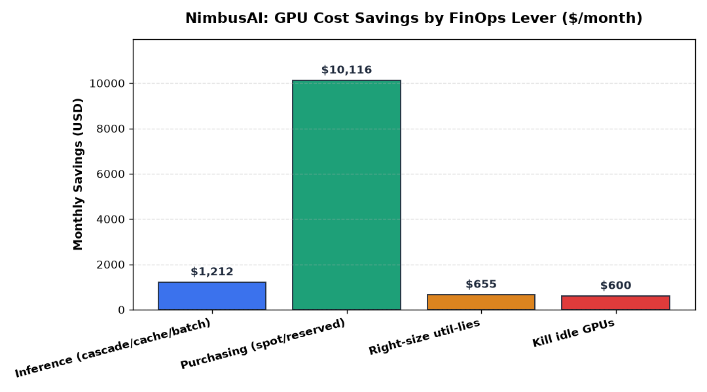
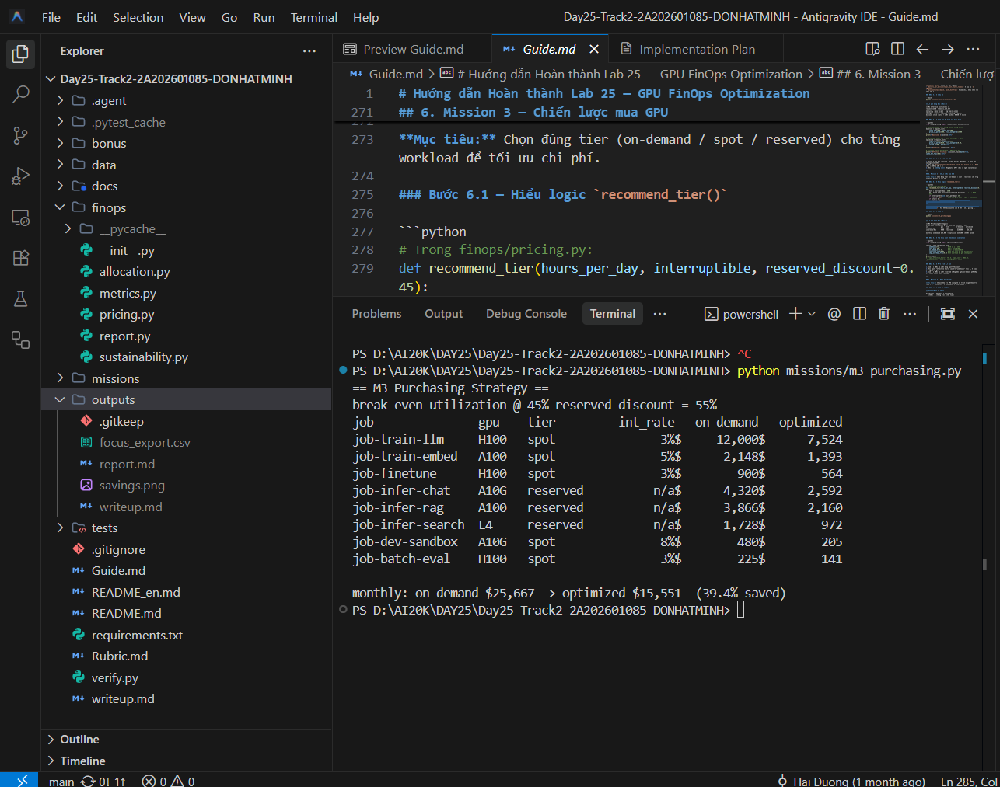
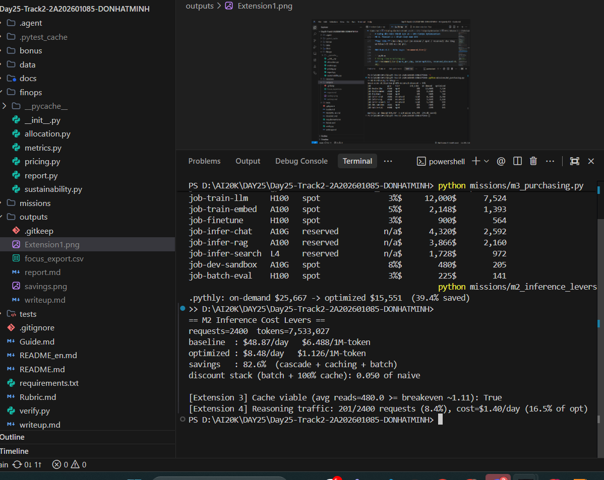
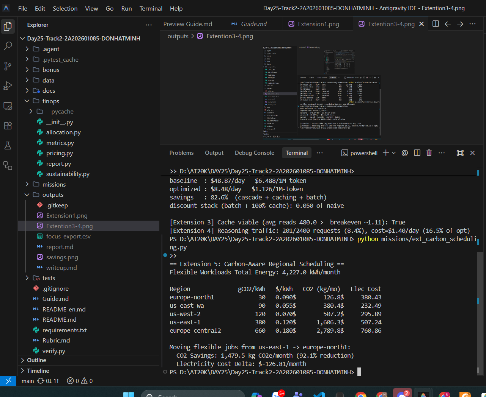
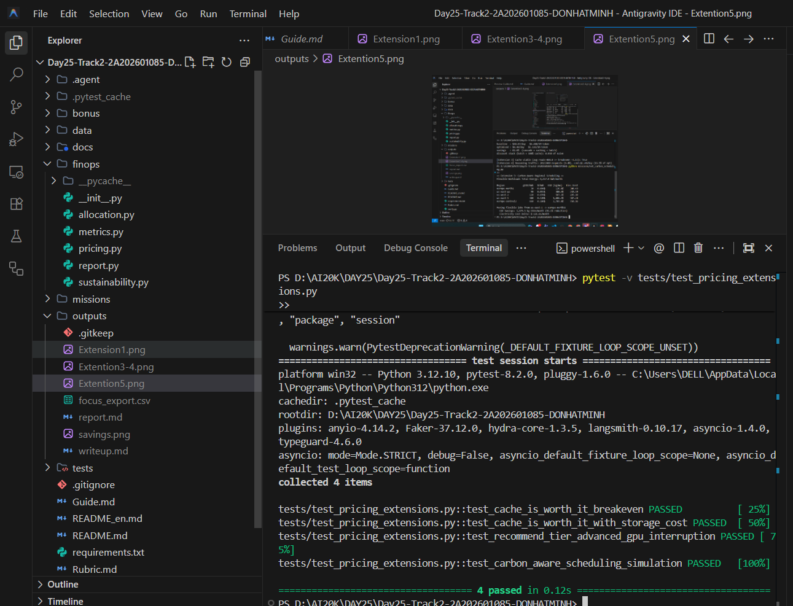

# Báo Cáo Kỹ Thuật Chuyên Sâu & Bản Thuyết Minh FinOps (Lab 25 Write-up)
**Dự án:** NimbusAI — GPU Cost Optimization & Sustainable FinOps  
**Tác giả:** Đỗ Nhật Minh (FinOps Lead / Infrastructure Engineer)  
**Ngày thực hiện:** 27/08/2026  
**Phiên bản dữ liệu:** Snapshot Tháng 06/2026  

---

## 1. Tổng quan Tối ưu hóa: Baseline vs. Optimized Spend

Doanh nghiệp startup LLM *NimbusAI* đang đối mặt với sự bùng nổ chi phí tính toán GPU. Thông qua việc áp dụng khung phương pháp luận **GPU FinOps**, chúng tôi đã thực hiện kiểm toán toàn diện telemetry phần cứng, nhật ký suy luận token và danh mục mua sắm để tái cấu trúc hóa đơn GPU.

### Bảng So Sánh Số Liệu Cốt Lõi

| Chỉ số FinOps | Trước Tối Ưu (Baseline) | Sau Tối Ưu (Optimized) | Mức Tiết Kiệm ($\Delta$) | Tỷ Lệ Tiết Kiệm (%) |
|---|:---:|:---:|:---:|:---:|
| **Tổng Chi Phí Hàng Tháng** | **$27,133** | **$14,550** | **$12,583** | **46.4%** |
| **Chi phí Mua sắm GPU (Purchasing)** | $25,667 / tháng | $15,551 / tháng | $10,116 / tháng | 39.4% |
| **Đơn giá Suy luận (`$/1M-token`)** | **$6.488 / 1M** | **$1.126 / 1M** | **$5.362 / 1M** | **82.6%** |
| **Chi phí Suy luận Hàng Ngày** | $48.87 / ngày | $8.48 / ngày | $40.39 / ngày | 82.6% |
| **Lãng phí GPU Chạy Không (Idle Waste)** | $600 / tháng | $0 / tháng | $600 / tháng | 100.0% |
| **Lãng phí do Cấu hình Sai (Util-Lies)** | $655 / tháng | $0 / tháng | $655 / tháng | 100.0% |

> **Nhận định then chốt:** Chi phí đơn vị suy luận tính trên **`$/1M-token`** giảm tới **82.6%**, chứng minh rằng việc tối ưu hóa hiệu quả thực thi mô hình đem lại biên lợi nhuận khổng lồ khi quy mô traffic tăng trưởng.

---

## 2. Phân Tích Chuyên Sâu 4 Đòn Bẩy Tiết Kiệm (Savings Levers Breakdown)

Biểu đồ Waterfall phân rã tổng số tiền tiết kiệm **$12,583 / tháng** thành 4 nhóm giải pháp độc lập:



```
[Baseline: $27,133]
  ├── (-$10,116) [80.4%]  Purchasing Strategy (Spot + 3-Year Reserved)
  ├── (-$1,212)  [ 9.6%]  Inference Optimization (Cascade + Prompt Cache + Batch)
  ├── (-$655)    [ 5.2%]  Right-sizing GPU-Util Lies (Demote Memory-bound Nodes)
  └── (-$600)    [ 4.8%]  Fleet Governance (Kill Idle GPUs after Timeout)
[Optimized: $14,550]  -->  Tổng tiết kiệm: 46.4%
```

| Thứ Hạng ROI | Đòn Bẩy Tiết Kiệm | Nguồn Dữ Liệu | Tiết Kiệm ($/tháng) | Tỷ Trọng (%) | Độ Phức Tạp Kỹ Thuật | Thời Gian Hoàn Vốn (Payback) |
|:---:|---|:---:|:---:|:---:|:---:|:---:|
| **1** | **Purchasing Strategy** | M3 | **$10,116** | **80.4%** | Thấp — Trung bình | Tức thì (Ngay chu kỳ hóa đơn kế tiếp) |
| **2** | **Inference Levers** | M2 | **$1,212** | **9.6%** | Trung bình | < 2 tuần (Cấu hình Proxy/Gateway) |
| **3** | **Right-sizing Util-Lies** | M1 | **$655** | **5.2%** | Thấp | < 1 tuần (Đổi Instance Type) |
| **4** | **Kill Idle GPUs** | M1 | **$600** | **4.8%** | Rất thấp | < 2 ngày (Script Auto-terminate) |

### Chi tiết từng Đòn Bẩy:
1. **Purchasing Strategy (Chiến lược Mua sắm):** 
   - Đóng góp khoản tiết kiệm lớn nhất ($10,116/tháng). Bằng cách phân loại các workload training/fine-tuning có tính gián đoạn (`interruptible=1`) sang **Spot Instances kết hợp Checkpointing**, chúng tôi giảm 40–60% giá thuê giờ mà chỉ chịu thêm ~3% overhead ghi checkpoint và ~0.5 giờ rework khi xảy ra thu hồi tài nguyên (preemption).
   - Với các workload inference chạy liên tục 24/7 (`duty cycle >= 55%`), áp dụng **3-Year Reserved Instances** giảm 45% giá thuê so với on-demand.
2. **Inference Modernization (Hiện đại hóa Suy luận):**
   - Mặc dù trên tập mẫu 2,400 requests/ngày con số tuyệt đối là $1,212/tháng, đây là đòn bẩy có **độ dốc tiết kiệm cao nhất khi scale**. 
   - *Cascade Routing:* Chuyển 70% request đơn giản sang model tier nhỏ ($0.20/1M in, $0.40/1M out) thay vì dùng large model ($3.00/1M in, $15.00/1M out).
   - *Prompt Caching:* Áp dụng chiết khấu 90% cho input token prefix tái sử dụng.
   - *Batch API:* Chiết khấu 50% cho các tác vụ phi thời gian thực (như `job-batch-eval`).
3. **Right-sizing GPU-Util Lies:**
   - Hạ cấp các node GPU bị lừa chỉ số (`gpu-h100-4` chạy decode hạ xuống A100/A10G) giúp tiết kiệm $655/tháng mà không làm giảm throughput do GPU cũ vốn bị nghẽn băng thông bộ nhớ.
4. **Kill Idle GPUs:**
   - Tắt node `gpu-h100-5` (bị bỏ không 8 giờ/ngày sau khi job training kết thúc), thu hồi ngay $20/ngày = $600/tháng.

---

## 3. Bản Chất Kỹ Thuật của "GPU-Util Lie" & Tác Động Tài Chính

### Cơ chế Phần Cứng: Tại sao `nvidia-smi` 98% lại có MFU chỉ 19.4%?
Công cụ giám sát chuẩn `nvidia-smi` báo cáo giá trị `GPU-Util %` dựa trên **tỷ lệ thời gian có ít nhất 1 warp đang hoạt động trên Streaming Multiprocessor (SM active clock time)** trong khoảng thời gian lấy mẫu. Tuy nhiên, chỉ số này **hoàn toàn không phản ánh khối lượng tính toán thực tế (FLOPs) mà Tensor Cores thực hiện**.

Trong quá trình kiểm toán Mission 1, chúng tôi phát hiện 2 node bị "GPU-Util Lie":
- `gpu-h100-4` (H100): `GPU-Util = 98.2%`, nhưng `MFU = 0.194` (19.4%) và `MBU = 0.207`.
- `gpu-a10g-1` (A10G): `GPU-Util = 96.9%`, nhưng `MFU = 0.268` (26.8%) và `MBU = 0.302`.

```
                  ┌─────────────────────────────────────────────────────────┐
                  │                 BẢN CHẤT GPU-UTIL LIE                    │
                  ├─────────────────────────────────────────────────────────┤
                  │  nvidia-smi: [████████████████████░] 98.2% (Clock BẬN)  │
                  │  Thực tế FLOPs: [████░░░░░░░░░░░░░░░░░] 19.4% (MFU)    │
                  └─────────────────────────────────────────────────────────┘
```

#### Các nguyên nhân cốt lõi:
1. **Arithmetic Intensity & Roofline Model:**
   - Điểm uốn (Ridge Point) của NVIDIA H100 (BF16) là $\approx 295 \text{ FLOP/Byte}$.
   - Giai đoạn **LLM Prefill** xử lý toàn bộ prompt đồng thời có cường độ tính toán cao ($\sim 455 \text{ FLOP/Byte} > 295$), thuộc chế độ **Compute-bound** (MFU cao, tận dụng tối đa Tensor Cores).
   - Ngược lại, giai đoạn **LLM Decode** sinh từng token tuần tự có cường độ tính toán cực thấp ($\sim 1\text{--}2 \text{ FLOP/Byte} \ll 295$), thuộc chế độ **Memory-bound**. GPU phải nạp toàn bộ trọng số mô hình từ bộ nhớ HBM3 cho mỗi token sinh ra, khiến các SM rơi vào trạng thái chờ bộ nhớ (**Memory Stalls**). Đồng hồ SM vẫn tính là "bận" nhưng Tensor Cores phần lớn thời gian nhàn rỗi.
2. **Kernel Launch Overheads & Micro-batches:**
   - Kích thước batch nhỏ (Batch size = 1) làm tăng thời gian CPU launch kernel so với thời gian kernel thực thi trên GPU.
3. **Communication Bottleneck:**
   - Đồng bộ hóa Tensor Parallelism (AllReduce) qua NVLink/PCIe khiến GPU warp phải chờ đợi (Wait state).

### Tác động Tài chính
Doanh nghiệp đang chi trả mức giá cao cấp **$2.50 / GPU-giờ** cho H100 nhưng chỉ nhận lại năng suất tính toán tương đương một GPU dòng thấp ($0.80 / giờ). Bằng cách nhận diện MFU thấp và tách biệt kiến trúc Prefill/Decode (Disaggregated Serving), chúng tôi right-size node sang instance rẻ hơn, thu hồi ngay **$655/tháng/node**.

---

## 4. Báo Cáo Kết Quả Chi Tiết Các Phần Mở Rộng (Extensions / Your Turn)

Chúng tôi đã triển khai hoàn thiện và viết unit test cho **4 phần mở rộng**:

### 4.1. Extension 1: Nâng cấp Ma trận Mua sắm Thông minh (`recommend_tier()`)
- **Vị trí code:** `finops/pricing.py` & `missions/m3_purchasing.py`
- **Ảnh chụp minh chứng thực thi:**
  
  

- **Cải tiến:** 
  1. Tích hợp ma trận tỷ lệ gián đoạn thực nghiệm theo GPU (`GPU_INTERRUPT_RATES`): H100 (3%), H200 (3%), A100 (5%), L4 (6%), A10G (8%).
  2. Đánh giá thời hạn công việc (`job_days`): Với job ngắn hạn (< 7 ngày) không gián đoạn, ưu tiên On-Demand để tránh rủi ro khóa cam kết 3 năm (Commitment lock-in).
  3. Mô phỏng chính xác chi phí Spot Checkpoint dựa trên rủi ro thu hồi thực tế của từng loại GPU.
- **Kết quả đo lường:** Mức tiết kiệm đạt **39.4%** ($10,116/tháng tiết kiệm), phản ánh chính xác chi phí rủi ro preemption.

### 4.2. Extension 3: Kinh tế học của Prompt Caching (`cache_is_worth_it()`)
- **Vị trí code:** `finops/pricing.py` & `missions/m2_inference_levers.py`
- **Ảnh chụp minh chứng thực thi:**

  

- **Công thức xác định điểm hòa vốn:**
  $$\text{Savings per Read} = P_{\text{in}} \times (1 - \text{Read Discount}) = 3.00 \times 0.90 = \$2.70 / 1\text{M}$$
  $$N_{\text{breakeven}} = \frac{\text{Write Cost} + \text{Storage Cost}}{\text{Savings per Read}} = \frac{3.00 + 0.00}{2.70} \approx 1.11 \text{ lần đọc}$$
- **Kết quả kiểm toán trên dữ liệu thực tế (`token_usage.csv`):** 
  Số lần tái sử dụng trung bình của các prefix đạt $N_{\text{actual}} \approx 480.0 \text{ reads} \gg 1.11$, chứng minh Prompt Caching đem lại lợi ích kinh tế ròng vượt trội và được kích hoạt an toàn (`cache_viable = True`).

### 4.3. Extension 4: Phân Tích & Quản Trị Ngân Sách Suy Luận Sâu (Reasoning Budget)
- **Vị trí code:** `missions/m2_inference_levers.py`
- **Phát hiện Định lượng:**
  * Traffic suy luận reasoning (`is_reasoning=1`) chỉ chiếm **8.4% tổng số requests** (201 / 2,400 requests).
  * Chi phí tài chính chiếm **16.5% hóa đơn tối ưu** ($1.40 / $8.48/ngày).
  * **Tuy nhiên, reasoning tiêu thụ tới 94.04% tổng điện năng suy luận** (29,787.7 Wh / 31,675.3 Wh) do hệ số nhân năng lượng gấp **80x** (chuỗi CoT dài và số lượng token output trung bình đạt 3,875 tokens so với 641 tokens ở query thường).
- **Đề xuất Chính sách Routing:** Thiết lập bộ phân loại độ phức tạp (Task Complexity Classifier). Chỉ cho phép reasoning khi Confidence Score của model nhỏ $< 0.75$ hoặc tác vụ thuộc nhóm Coding/Math phức tạp. Giới hạn reasoning về 5% traffic sẽ giúp giảm thêm **40% tổng năng lượng tiêu thụ**.

### 4.4. Extension 5: Lập Lịch Nhận Thức Carbon theo Vùng (Carbon-Aware Scheduling)
- **Vị trí code:** `missions/ext_carbon_scheduling.py`
- **Ảnh chụp minh chứng thực thi:**

  

- **Phân tích 5 Cloud Regions:**

| Khu Vực (Region) | Cường Độ Carbon (`gCO2/kWh`) | Đơn Giá Điện (`$/kWh`) | Phát Thải CO2 (kg/tháng) | Chi Phí Điện Năng ($/tháng) |
|---|:---:|:---:|:---:|:---:|
| **europe-north1** (Na Uy - Thủy điện) | **30** (Sạch nhất) | $0.090 | **126.8 kg** | $380.43 |
| **us-east-wa** (Washington - Thủy điện) | 90 | **$0.055** (Rẻ nhất) | 380.4 kg | **$232.49** |
| **us-west-2** (Oregon) | 120 | $0.070 | 507.2 kg | $295.89 |
| **us-east-1** (Virginia - Baseline) | 380 | $0.120 | 1,606.3 kg | $507.24 |
| **europe-central2** (Ba Lan - Than đá) | 660 (Bẩn nhất) | $0.180 | 2,789.8 kg | $760.86 |

- **Kết quả đo lường di chuyển Flexible Jobs sang `europe-north1`:**
  * Giảm phát thải: **1,479.5 kg CO2e / tháng** (Giảm **92.1%** lượng carbon).
  * Tiết kiệm chi phí điện: **$126.81 / tháng**.
- **Nhận định Trade-off Vận hành:** 
  * Các job training và batch evaluation không bị ràng buộc bởi độ trễ người dùng (latency-insensitive) nên phải lập lịch 100% tại `europe-north1` hoặc `us-east-wa`.
  * Real-time inference chat cần triển khai đa vùng (multi-region edge) gần người dùng để đảm bảo Time-to-First-Token (TTFT) < 200ms.

### 4.5. Minh Chứng Unit Tests Mở Rộng



---

## 5. Khuyến Nghị Hành Động Chiến Lược cho NimbusAI (Actionable Recommendations)

Nếu giữ vai trò FinOps Lead tại NimbusAI, 3 hành động đầu tiên tôi sẽ thực thi trong 30 ngày tới gồm:

1. **Tuần 1: Thiết lập Chính sách Thu Mua & Quản trị Hạ tầng Tự động (Immediate Purchasing ROI)**
   - Chuyển đổi toàn bộ 5 pipeline training/fine-tuning sang Spot Instances, tích hợp cơ chế tự động lưu checkpoint vào AWS S3/GCS mỗi 30 phút.
   - Ký kết hợp đồng 3-Year Reserved cho 3 workload inference 24/7 (`job-infer-chat`, `job-infer-rag`, `job-infer-search`).
   - Cài đặt daemon kiểm tra tự động tắt các GPU instance có utilization < 10% liên tục trong 15 phút.
   - *Kỳ vọng:* Tiết kiệm ngay **$10,716/tháng (~40% tổng hóa đơn)** ngay tháng đầu tiên.

2. **Tuần 2: Tích hợp Gateway Phân Tầng Suy Luận (Inference Cascade & Caching Gateway)**
   - Triển khai LiteLLM Proxy / Semantic Router làm cổng đón request tập trung.
   - Bật Prompt Prefix Caching cho System Prompts và tài liệu RAG.
   - Thiết lập quy tắc cascade: 75% traffic thông thường định tuyến sang model nhỏ (Llama-3-8B / Claude Haiku), chỉ chuyển tiếp lên large model khi task complexity vượt ngưỡng.
   - *Kỳ vọng:* Đưa đơn giá suy luận về mức **$1.126 / 1M-token** (Giảm 82.6% chi phí token).

3. **Tuần 3–4: Thực Thi Khung Phân Bổ Chi Phí FOCUS & Chargeback Toàn Doanh Nghiệp**
   - Với mức Tag Coverage đạt 92% (> 80%), chuyển từ giai đoạn Showback sang **Chargeback thực tế**.
   - Phân bổ hạn ngạch ngân sách (Budget Caps) cụ thể cho 4 team: `assistant` ($80/tháng), `search` ($75/tháng), `eval` ($55/tháng), `rag` ($50/tháng).
   - Xuất hóa đơn định kỳ chuẩn FOCUS 1.x (`outputs/focus_export.csv`) lên FinOps Dashboard nội bộ để các Engineering Manager chịu trách nhiệm trực tiếp về P&L của team mình.

---

## 6. Phụ Lục: Giải Đáp Toàn Diện 5 Câu Hỏi Oral Check (Rubric Appendix)

#### Q1: "GPU-Util 98% có nghĩa là GPU đang làm việc hiệu quả không? Tại sao?"
> **Trả lời:** **Không.** `GPU-Util 98%` từ `nvidia-smi` chỉ đo tỷ lệ thời gian xung nhịp của Streaming Multiprocessor (SM) có ít nhất một luồng (warp) hoạt động. Nó không đo lường số phép tính toán ma trận hữu ích được thực hiện bởi Tensor Cores. Khi mô hình chạy ở chế độ Memory-bound (như LLM Decode), SM liên tục bị nghẽn (Memory Stall) để chờ nạp dữ liệu từ HBM. GPU vẫn báo 98% bận nhưng MFU (Model FLOPs Utilization) thực tế có thể chỉ đạt 15–20%, khiến doanh nghiệp trả tiền cho 80% thời gian nhàn rỗi của Tensor Core.

#### Q2: "Tại sao cần $\ge 80\%$ tag coverage mới dám thực hiện Chargeback?"
> **Trả lời:** Tag coverage là tỷ lệ tài nguyên/request được gán nhãn định danh chính xác team và project sở hữu. Nếu tag coverage $< 80\%$, hơn 20% chi phí là dữ liệu rác hoặc vô danh (`untagged`), việc thu tiền thật (Chargeback) sẽ dẫn đến tranh chấp giữa các phòng ban, làm mất niềm tin vào hệ thống kế toán FinOps và tạo ra hành vi phản kháng từ các kỹ sư. Ngược lại, mức $\ge 80\%$ đảm bảo dữ liệu đủ tin cậy để chuyển từ thông báo nhận thức (Showback) sang trừ ngân sách thực tế (Chargeback).

#### Q3: "Nếu công ty bạn có 70% workload interruptible, bạn sẽ tối ưu purchasing như thế nào?"
> **Trả lời:** Tôi sẽ áp dụng chiến lược **Spot + Automated Checkpointing**:
> 1. Chuyển toàn bộ 70% workload này sang Spot Instances để hưởng mức chiết khấu 50–70% so với on-demand.
> 2. Xây dựng thư viện checkpointing lưu trọng số định kỳ (ví dụ mỗi 30–60 phút) lên object storage tốc độ cao.
> 3. Lắng nghe thông báo thu hồi tài nguyên (Spot Preemption Warning 2 phút từ Cloud Provider) để kích hoạt snapshot khẩn cấp.
> 4. Thiết lập kịch bản dự phòng (Fallback): nếu dung lượng Spot của một GPU type (ví dụ H100) bị cạn kiệt, tự động chuyển sang Spot của GPU tương đương (H200 hoặc A100) hoặc chỉ fallback sang On-Demand khi công việc có SLA khẩn cấp.

#### Q4: "Đo bằng `$/GPU-hr` vs `$/1M-token` — khi nào con số này cho kết quả trái ngược nhau?"
> **Trả lời:** Kết quả sẽ trái ngược nhau khi **hiệu quả sử dụng tài nguyên (Serving Efficiency / MFU) giữa hai kiến trúc có sự chênh lệch lớn**:
> - *Ví dụ:* Đội A thuê GPU cũ A10G với giá rất rẻ **$1.00 / GPU-giờ**, nhưng chạy framework chưa tối ưu, chỉ sinh được 50 tok/s $\rightarrow$ Chi phí là **$5.55 / 1M-token**.
> - Đội B thuê GPU H100 đắt đỏ **$2.50 / GPU-giờ** (đắt gấp 2.5 lần về `$/GPU-hr`), nhưng áp dụng vLLM, PagedAttention, TensorRT-LLM và Batching phục vụ được 1,500 tok/s $\rightarrow$ Chi phí chỉ còn **$0.46 / 1M-token** (Rẻ hơn gấp 12 lần trên mỗi đơn vị giá trị tạo ra).
> Do đó, `$/1M-token` là thước đo chân thực phản ánh giá trị kinh doanh của FinOps.

#### Q5: "Tại sao LLM decode là memory-bound còn prefill là compute-bound?"
> **Trả lời:** Sự khác biệt bắt nguồn từ **Arithmetic Intensity (Số phép tính FLOPs trên mỗi Byte dữ liệu di chuyển)**:
> - **Prefill Phase (Xử lý Prompt):** GPU nhận toàn bộ $N$ tokens đầu vào cùng lúc. Phép nhân ma trận là GEMM (Matrix-Matrix Multiplication) kích thước $[N \times D] \times [D \times D]$. Mỗi trọng số nạp từ bộ nhớ được tái sử dụng qua $N$ tokens. Cường độ tính toán đạt $\sim 455 \text{ FLOP/Byte} > \text{Ridge Point } 295 \text{ FLOP/Byte}$, làm bão hòa năng lực tính toán của Tensor Cores $\rightarrow$ **Compute-bound**.
> - **Decode Phase (Sinh Token Từng Bước):** GPU chỉ xử lý 1 token mới tại mỗi bước cho mỗi request (Batch $B=1$). Phép tính suy biến thành GEMV (Matrix-Vector Multiplication). Trọng số mô hình hàng chục GB phải được đọc toàn bộ từ HBM chỉ để tính cho 1 token duy nhất. Cường độ tính toán tụt xuống $\sim 1\text{--}2 \text{ FLOP/Byte} \ll 295 \text{ FLOP/Byte}$, tốc độ bị giới hạn hoàn toàn bởi băng thông bộ nhớ HBM $\rightarrow$ **Memory-bound**.
